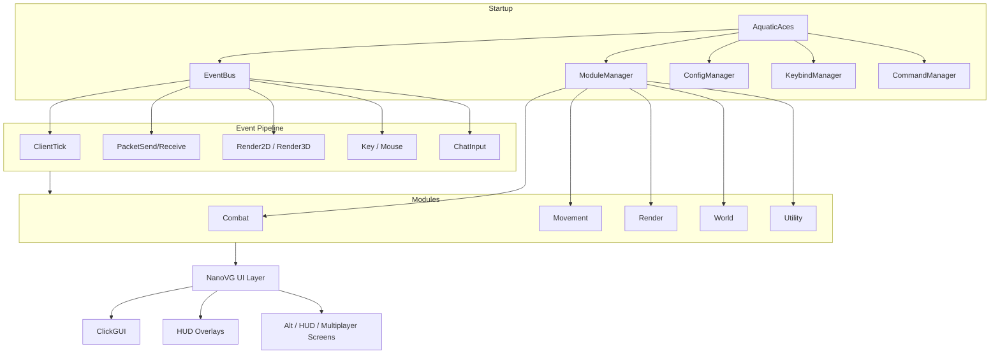

<p align="center">
  
  
  
  
</p>

<h1 align="center">Aquatic Aces</h1>

<p align="center">
  <strong>A modular Fabric client for Minecraft 1.21 — built with Kotlin, NanoVG, and a high-speed event bus.</strong>
</p>

<p align="center">
  60+ modules · Custom ClickGUI · Drag-and-drop HUD editor · Schematic preview · Profile system · Alt manager
</p>

---

## Overview

**Aquatic Aces** is a client-side Fabric mod engineered for performance, extensibility, and polish. Every feature routes through a lightweight event bus, modules declare settings with dependency chains, and the entire UI is rendered with **NanoVG** — smooth rounded panels, gradient accents, HSV color picking, and animated notifications.

Whether you're testing mechanics on a private server, prototyping module behavior, or exploring client architecture, Aquatic Aces gives you a production-grade foundation out of the box.

---

## Highlights

| Feature | Description |
|---|---|
| **NanoVG ClickGUI** | Scrollable category panels, live search, theme editor, HSV color picker, keybind labels on every module row |
| **HUD Suite** | Target, Stats, ArrayList, Notifications, Performance, Coordinates — toggle individually or drag positions |
| **Event Bus** | Priority-aware `@Subscribe` handlers for ticks, packets, rendering, input, and chat |
| **Config Profiles** | Save/load full profiles or per-category snapshots as JSON |
| **Schematic Tools** | Capture block regions, preview ghost wireframes, mirror placements with Symmetry Brush |
| **Social Layer** | Friends list, waypoints, alt account manager with custom multiplayer screen |
| **Infrastructure** | Rotation manager, backtrack store, target validator, server detector, module conflict resolver |
| **ProGuard Build** | Optional obfuscated release jar via `./gradlew buildObfuscated` |

---

## Quick Start

### Requirements

- **Java 21** (required for Minecraft 1.21)
- **Gradle 9.x** (wrapper included)
- **Fabric Loader** `0.15.11+`
- **Fabric API** for 1.21

### Install

1. Build the mod (see [Building](#building)) or grab the jar from `build/libs/`.
2. Drop `aquaticaces-1.0.0.jar` into your `.minecraft/mods` folder.
3. Launch Minecraft **1.21** with the Fabric profile.

### First Launch

| Action | Default |
|---|---|
| Open ClickGUI | **Right Shift** |
| Chat commands | Prefix with `.` |
| Toggle a module | ClickGUI or `.toggle <module>` |
| Bind a key | `.bind <module> <key>` |

On first run, Aquatic Aces creates a config folder at `.minecraft/aquaticaces/` and loads the default **Ghost** profile.

---

## ClickGUI

Press **Right Shift** to open the menu.

- **Search bar** — filter modules across all categories in real time
- **Category panels** — Combat, Movement, Render, World, Exploit, Player, Utility, Ghost
- **Theme panel** — accent gradients, panel background, blur strength
- **Settings** — booleans, sliders, modes, colors (with HSV wheel), and conditional visibility via `dependsOn()`
- **Keybinds** — shown on each module row; rebind via right-click flow or `.bind`

---

## HUD System

Six always-on overlays render through NanoVG. Control them two ways:

1. **`.hud`** — opens the HUD Settings screen (toggle each element ON/OFF)
2. **`.hud edit`** or **HUD Editor module** — drag-and-drop position editor

| HUD | Shows |
|---|---|
| **Target** | KillAura target name, HP bar, distance |
| **Stats** | Speed, CPS, ping |
| **ArrayList** | Enabled modules, sorted by width |
| **Notifications** | Module enable/disable toasts with slide animation |
| **Performance** | FPS, frame time |
| **Coordinates** | XYZ, facing, biome |

Positions persist to `aquaticaces/hud.json`. Toggle states persist to `aquaticaces/hud-settings.json`.

---

## Commands

All commands use the `.` prefix.

| Command | Usage | Description |
|---|---|---|
| `.help` | `.help` | List all commands |
| `.toggle` | `.toggle <module>` | Enable/disable a module |
| `.bind` | `.bind <module> <key>` | Set a module keybind |
| `.config` | `.config load/save [profile] [category]` | Load or save profiles (full or per-category) |
| `.friend` | `.friend add/remove/list [name]` | Manage friends list |
| `.alt` | `.alt add/remove/list/switch [name]` | Manage alt accounts |
| `.hud` | `.hud` or `.hud edit` | HUD toggles or position editor |
| `.wp` | `.wp add/remove/list [name]` | Waypoint management |
| `.schematic` | `.schematic save/load/list/clear [name] [radius]` | Capture and preview block schematics |

**Examples**

```
.toggle KillAura
.bind Scaffold R
.config save PvP COMBAT
.schematic save base 12
.schematic load base
.friend add Steve
.hud edit
```

---

## Modules

<details>
<summary><strong>Combat (17)</strong></summary>

AntiBot · Backtrack · KillAura · TriggerBot · AimAssist · SilentAim · AutoCrystal · AutoAnchor · Criticals · Velocity · KeepSprint · ShieldBreaker · WTap · AutoPot · NoSwing · Surround · HoleFill

</details>

<details>
<summary><strong>Movement (14)</strong></summary>

Sprint · Flight · Speed · Step · Scaffold · Jesus · NoSlowdown · Blink · NoFall · SafeWalk · Parkour · Spider · LongJump · ElytraFly

</details>

<details>
<summary><strong>Render (17)</strong></summary>

ESP · Chams · XRay · Tracers · Nametags · Freecam · ClickGUI · DamageIndicators · Fullbright · Zoom · BlockESP · StorageESP · LogoutSpot · Breadcrumbs · Waypoints · ViewModel

</details>

<details>
<summary><strong>World (6)</strong></summary>

Timer · FastPlace · GhostHand · LiquidInteract · SchematicPreview · SymmetryBrush

</details>

<details>
<summary><strong>Exploit (2)</strong></summary>

Phase · TickShift

</details>

<details>
<summary><strong>Player (6)</strong></summary>

InventoryManager · AutoEat · Derp · AutoTool · AutoArmor · FastUse · MiddleClickFriend

</details>

<details>
<summary><strong>Utility (5)</strong></summary>

AutoTotem · ChestStealer · AutoReconnect · PingSpoof · HUD Editor

</details>

<details>
<summary><strong>Ghost (3)</strong></summary>

SelfDestruct · Hitboxes · Reach

</details>

---

## Schematic Workflow

```
.schematic save house 10   →  captures a 21×21×21 region around you
.schematic load house      →  loads the JSON into memory
Enable SchematicPreview    →  renders cyan ghost wireframes at origin
Enable SymmetryBrush       →  mirrors block placements across X / Y / Z
```

Schematics are stored at `.minecraft/aquaticaces/schematics/`.

---

## Configuration

Profiles live in `.minecraft/aquaticaces/profiles/`.

```
.config save MyProfile          # save everything
.config save MyProfile COMBAT   # save only Combat modules
.config load MyProfile          # load a profile
.config load MyProfile RENDER   # load only Render modules
```

Each profile stores module state, keybinds, and all setting values as JSON.

### Data Files

| Path | Purpose |
|---|---|
| `aquaticaces/profiles/` | Module configuration profiles |
| `aquaticaces/hud.json` | HUD element positions |
| `aquaticaces/hud-settings.json` | HUD element visibility toggles |
| `aquaticaces/schematics/` | Saved block schematics |
| `aquaticaces/friends.json` | Friends list |
| `aquaticaces/alts.json` | Alt account storage |
| `aquaticaces/waypoints.json` | World waypoints |

---

## Architecture



### Core Systems

| System | Role |
|---|---|
| `EventBus` | Registers `@Subscribe` listeners with priority ordering |
| `ModuleConflicts` | Auto-disables conflicting modules on enable |
| `RotationManager` | Silent rotation queue applied post-tick |
| `NotificationManager` | Toast queue for HUD notification overlay |
| `ServerDetector` | Lobby / in-game gating for `canRun()` |
| `PacketUtils` | Typed packet field access via mixins (no reflection) |
| `ClientTheme` | Global accent colors and blur, synced from ClickGUI module |

### Tech Stack

- **Language:** Kotlin 2.0 + Java 21 mixins
- **Loader:** Fabric 0.15.11
- **Mappings:** Official Mojang mappings
- **UI:** LWJGL NanoVG 3.3.3 with custom `VectorRenderer` + `FontRenderer`
- **Serialization:** kotlinx.serialization JSON
- **Build:** Fabric Loom 1.10.5 + optional ProGuard 7.5

---

## Building

```bash
# Standard build (outputs remapped jar to build/libs/)
./gradlew build

# Obfuscated release build
./gradlew buildObfuscated
# → build/libs/aquaticaces-1.0.0-obfuscated.jar
```

### Java 21 Setup

If Gradle can't find Java 21, set it in `gradle.properties`:

```properties
org.gradle.java.home=/path/to/jdk-21
```

Or export `JAVA_HOME` before building:

```bash
export JAVA_HOME=$(/usr/libexec/java_home -v 21)
./gradlew build
```

---

## Project Structure

```
src/main/
├── java/com/aquaticaces/mixin/     # Mixin accessors & injections
├── kotlin/com/aquaticaces/
│   ├── AquaticAces.kt              # Entry point
│   ├── command/                    # Dot-prefix command system
│   ├── config/                     # JSON profile manager
│   ├── core/                       # Managers (HUD, friends, alts, schematics…)
│   ├── event/                      # Event bus & event types
│   ├── keybind/                    # Global keybind routing
│   ├── module/                     # Module base + 60+ implementations
│   └── ui/                         # NanoVG screens, components, HUD overlays
└── resources/
    ├── fabric.mod.json
    └── aquaticaces.mixins.json
```

---

## Adding a Module

```kotlin
class MyModule : Module("MyModule", "Does something cool.", Category.UTILITY) {

    val speed = NumberSetting("Speed", 1.0, 0.1, 5.0, 0.1)

    init { addSettings(speed) }

    @Subscribe
    fun onTick(event: EventClientTick) {
        if (!canRun()) return
        // your logic
    }
}
```

Register it in `ModuleManager.kt`, rebuild, and it appears in ClickGUI automatically.

---

## Website

A React landing page lives in [`website/`](website/) with download links, install guide, module browser, and command reference.

```bash
cd website && npm install && npm run dev
```

Build for deployment: `npm run build` → deploy the `website/dist/` folder.

---

## Disclaimer

Aquatic Aces is provided for **educational purposes and private/testing environments only**. Using client modifications on public servers may violate server rules and the Minecraft EULA. The authors are not responsible for how this software is used.

---

## License

MIT License — see [fabric.mod.json](src/main/resources/fabric.mod.json).

---

<p align="center">
  <sub>Built with Kotlin · Fabric · NanoVG</sub>
</p>
